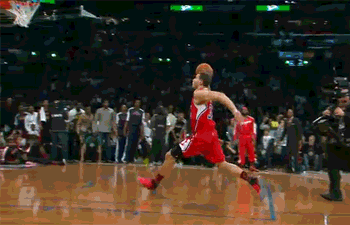

# NBA-Jammifier
Computer vision application which takes in NBA dunk videos and exaggerates the vertical movement of the dunker. This is inspired by NBA Jam, the video game.

## How to Run
Run this code: `python main.py -g [path to gif] -f [path to save folder] -m [path to Mask RCNN folder] -e [Exaggeration number (pixels)] -l [Load? For reruns or debugging. True or leave blank]`

## Results
| Original                            | Exaggerated                       |
|-------------------------------------|-------------------------------------|
|  |          |
|  |          |
|   |            |

## Detailed Explanation
https://maxogryzko.com/projects/jump-exaggeration-app/more-info
